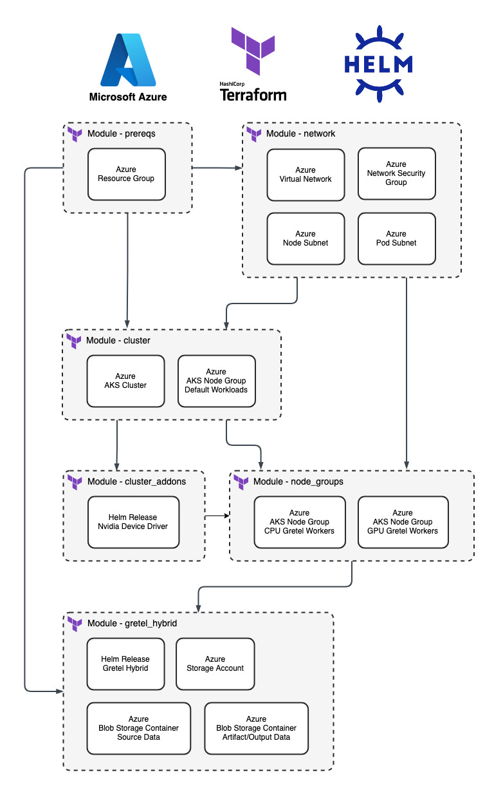

# Azure Gretel Hybrid Setup

## Overview

This module will create an AKS Cluster (and its dependent resources), configure it, and deploy Gretel's hybrid agent (gretel-agent) so that hybrid jobs may be run within the cluster. The module supports autoscaling from zero nodes, so the minimum capacity for node groups can be set to zero and cluster autoscaler will provision nodes when it sees pending jobs. This can save on compute costs for expensive GPU nodes as they will only be provisioned when needed, and they will be deleted when idle.

Note: The terms "Gretel Hybrid", "Gretel Agent", and "gretel-agent" are essentially synonymous and may be used interchangeably.

There are 6 primary submodules within this module that may be utilized or left out from a deployment as needed.

- `prereqs` deploys any prerequisite resources. In this case, it is only the Azure Resource Group that all resources will be placed in. You do not need this module if you wish to use an existing Azure Resource Group for your deployment.
- `network` deploys an Azure Virtual Network along with a Node Subnet and a Pod Subnet. A network security group is also deployed at the subnet level and attached to both the node and pod subnets. You do not need this module if you wish to use an existing virtual network for your AKS cluster or you already have an AKS cluster.
- `cluster` deploys an AKS cluster and a default node group for any generic services to run (eg. kube-system resources). You do not need this module if you wish to use an existing AKS cluster.
- `cluster_addons` deploys any necessary prerequisite resources to the Kubernetes Cluster that Gretel Hybrid requires. In this case it is just the [nvidia-device-plugin](https://github.com/NVIDIA/k8s-device-plugin) which is the driver required for GPU nodes. You do not need this module if you already have the nvidia-device-plugin deployed within an existing AKS cluster that you plan to deploy Gretel Hybrid into.
- `node_groups` deploys 2 AKS Node Pools into your AKS cluster. One node pool for CPU Gretel Workers and the other for GPU Gretel Workers. This module is required unless you have provisioned node groups for Gretel Hybrid to use outside of Terraform.
- `gretel_hybrid` deploys the Gretel Agent Helm Chart into your AKS cluster. It also creates the necessary blob storage for the Gretel Hybrid service to function.



Note: This README assumes the operator will be deploying this module from a local workstation using the Terraform CLI. If this module is going to be deployed via GitOps/CICD then it is assumed the operator can adapt these instructions for their automation based use case.

## Table of Contents

- [Azure Gretel Hybrid Setup](#azure-gretel-hybrid-setup)
  - [Overview](#overview)
  - [Table of Contents](#table-of-contents)
  - [Prerequisites](#prerequisites)
  - [Deployment](#deployment)
    - [Authenticate with Azure](#authenticate-with-azure)
    - [Setup Gretel API Key](#setup-gretel-api-key)
    - [Setup Terraform State Store](#setup-terraform-state-store)
    - [Configure Variables](#configure-variables)
    - [Deploy](#deploy)
  - [Test Your Hybrid Deployment](#test-your-hybrid-deployment)
    - [Setup Kubeconfig](#setup-kubeconfig)
    - [Examining Kubernetes Resources](#examining-kubernetes-resources)
    - [Run a Job](#run-a-job)
  - [Clean Up](#clean-up)

## Prerequisites

[Install the az cli.](https://learn.microsoft.com/en-us/cli/azure/install-azure-cli)

[Install the Terraform CLI.](https://developer.hashicorp.com/terraform/tutorials/azure-get-started/install-cli).

It is also recommended to [install the kubectl CLI](https://kubernetes.io/docs/tasks/tools/) if you want to take a closer look at the Kubernetes resources that are provisioned.

## Deployment

### Authenticate with Azure

The first step necessary is to authenticate with Azure within your shell session. See: https://learn.microsoft.com/en-us/cli/azure/authenticate-azure-cli

```sh
az login
```

Confirm you are authenticated with your desired account by running the below command.

```sh
az account show
```

### Setup Gretel API Key

Since we do not want to statically define sensitive credentials in clear text, we will pass your Gretel API Key to Terraform [using an environment variable](https://developer.hashicorp.com/terraform/cli/config/environment-variables#tf_var_name) in the format `TF_VAR_<terraform_variable_name>`.

You can get your Gretel API key from the console by clicking the drop down menu in the top right hand corner of the console and selecting "API Key" under the "Account Settings" section. Here is a direct link to this page: https://console.gretel.ai/users/me/key/

After retrieving your API Key export the necessary variable using the below command. 

```sh
export TF_VAR_gretel_api_key="<insert_key_here>"
```

Don't forget to delete this entry from your shell history afterward! The method for doing so can vary by shell.


### Setup Terraform State Store

See: https://developer.hashicorp.com/terraform/language/settings/backends/configuration

Run the `bootstrap_state_backend.sh` script in the `tf/scripts` directory to create an Azure storage container that can be used as the Terraform backend.

```sh
# Example
cd tf/scripts
./bootstrap_state_backend.sh --location "southcentralus" --resource-group "tfstate" --storage-account "tfstategretel" --container "tfstate"
```

The script will output an example backend configuration that you can use to declare your terraform backend. 

```
$ ./bootstrap_state_backend.sh --location "southcentralus" --resource-group "tfstate" --storage-account "tfstategretel" --container "tfstate"

Example Terraform Backend Configuration:
========================================

terraform {
  backend "azurerm" {
    resource_group_name   = "tfstate"
    storage_account_name  = "tfstategretel"
    container_name        = "tfstate"
    key                   = "gretel-hybrid-env.tfstate"
  }
}
```

**Whether you are using the full_deployment or existing_cluster example, take this backend configuration and replace the existing backend configuration in `main.tf`!**

For testing purposes you can also use a local backend which can be explicitly declared as shown below. A local backend is the default with Terraform, so you can also leave an empty `terraform {}` block to use a local backend as well.

```
# Local backend option 1
terraform {}

# Local backend option 2
terraform {
  backend "local" {
    path = "terraform.tfstate"
  }
}
```

### Configure Variables

After setting up the backend configuration in `main.tf` you should review the variables in the `terraform.tfvars` file and configure them as desired.

### Deploy

Run these `terraform` commands from the root of the current directory.

```sh
# Initialize terraform. This is an idempotent operation and is always safe to do (resources will not be created/destroyed).
terraform init

# View the changes terraform will make upon deployment. Use this any time you make changes to take a closer look at what is going on.
terraform plan

# Deploy the module. This will require user confirmation so don't walk away from your shell until you confirm by typing "yes" and start the deployment.
terraform apply
```

After the resources successfully deploy, you can [schedule a hybrid job](https://docs.gretel.ai/guides/environment-setup/running-gretel-hybrid/azure-setup#test-your-deployment.2-1) within your Gretel Project and it should run within your cluster! We will cover this later in this README as well.

## Test Your Hybrid Deployment

### Setup Kubeconfig

You can authenticate with your cluster with the following command. The authentication info will be saved to your kubeconfig which lives in `~/.kube/config`

```sh
# This command needs run once to create your kubeconfig for this cluster
az aks get-credentials --resource-group "resource_group_name_here" --name "cluster_name_here"
```

### Examining Kubernetes Resources

Now we can take a look at the Kubernetes resources using `kubectl`. Let's look at namespaces first. You'll see below that the `gretel-hybrid` namespace exists (created by this module) and so all of our other `kubectl` commands will reference this namespace.

```sh
# List the k8s namespaces. Almost every resource within k8s is associated with a namespace.
kubectl get namespaces

# Example output from a cluster deployed with this module
NAME                   STATUS   AGE
default                Active   3h23m
gretel-hybrid          Active   3h20m
kube-node-lease        Active   3h23m
kube-public            Active   3h23m
kube-system            Active   3h23m
nvidia-device-plugin   Active   3h21m
```

Now we can confirm the gretel-agent is running.

```sh
kubectl get pods -n gretel-hybrid

# Example output from a cluster deployed with this module
NAME                            READY   STATUS    RESTARTS   AGE
gretel-agent-65b7fb748c-xgx88   1/1     Running   0          3h20m
```

We can take a look at the gretel-agent logs if we'd like to.

```sh
# Note: If you want to tail the logs add in the -f flag
kubectl logs -l app.kubernetes.io/name=gretel-agent -n gretel-hybrid

# Example output from a cluster deployed with this module
Updating CA certificates...
Updating certificates in /etc/ssl/certs...
137 added, 0 removed; done.
Running hooks in /etc/ca-certificates/update.d...
done.
Done updating CA certificates.
INFO: Starting Gretel agent using driver k8s.
2023-10-04T21:07:45.668Z [1] - INFO - gretel_client.agents.agent - Enabling prometheus client
2023-10-04T21:07:45.670Z [1] - INFO - gretel_client.agents.agent - Agent started, waiting for work to arrive
2023-10-04T21:07:45.688Z [1] - INFO - gretel_client.agents.drivers.k8s - Creating pull secret
2023-10-04T21:08:56.312Z [1] - INFO - gretel_client.agents.agent - Heartbeat from poller, still here...
2023-10-04T21:09:46.930Z [1] - INFO - gretel_client.agents.agent - Heartbeat from poller, still here...
2023-10-04T21:09:53.690Z [1] - INFO - gretel_client.agents.drivers.k8s - Updating pull secret
2023-10-04T21:10:37.673Z [1] - INFO - gretel_client.agents.agent - Heartbeat from poller, still here...
2023-10-04T21:11:28.424Z [1] - INFO - gretel_client.agents.agent - Heartbeat from poller, still here...
2023-10-04T21:12:19.157Z [1] - INFO - gretel_client.agents.agent - Heartbeat from poller, still here...
2023-10-04T21:13:09.903Z [1] - INFO - gretel_client.agents.agent - Heartbeat from poller, still here...
2023-10-04T21:14:00.642Z [1] - INFO - gretel_client.agents.agent - Heartbeat from poller, still here...
2023-10-04T21:14:51.397Z [1] - INFO - gretel_client.agents.agent - Heartbeat from poller, still here...
2023-10-04T21:14:54.203Z [1] - INFO - gretel_client.agents.drivers.k8s - Updating pull secret
```

### Run a Job

Now let's schedule a hybrid job [following our documentation here](https://docs.gretel.ai/guides/environment-setup/running-gretel-hybrid/azure-setup#test-your-deployment.2-1). The necessary commands are included below.

```sh
# Set the below variables to point to your source Azure Storage Account and Source Container that you defined in the vars.auto.tfvars file
SOURCE_STORAGE_ACCOUNT="hybriddemo"
SOURCE_CONTAINER="hybrid-demo-gretel-source"

# Run this block of commands to upload the test CSV data to your Azure Source Container.
wget https://raw.githubusercontent.com/gretelai/gretel-blueprints/main/sample_data/sample-synthetic-healthcare.csv
az storage blob upload --container-name $SOURCE_BUCKET --type block --name sample-synthetic-healthcare.csv --file sample-synthetic-healthcare.csv --account-name $SOURCE_STORAGE_ACCOUNT
rm -f sample-synthetic-healthcare.csv

# Create a Gretel Project
GRETEL_PROJECT="GPU-test-$RANDOM"
gretel projects create --name "$GRETEL_PROJECT" --display-name "Gretel Hybrid Test"

# Option 1: CPU Test
# Create a model training job with CPU based Amplify model.
gretel models create --config synthetics/amplify \
  --in-data azure://$SOURCE_CONTAINER/sample-synthetic-healthcare.csv \
  --runner manual \
  --project $GRETEL_PROJECT

# Option 2: GPU Test
# Create a model training job with GPU based ACTGAN model.
gretel models create --config synthetics/tabular-actgan \
    --in-data azure://$SOURCE_CONTAINER/sample-synthetic-healthcare.csv \
    --runner manual \
    --project $GRETEL_PROJECT
```

Now that a hybrid job is created via the Gretel API, let's look at the corresponding k8s resources. Wait 30 seconds or so after starting your job and then run the below command again to take a look at the pods in our gretel-hybrid namespace.

```sh
kubectl get pods -n gretel-hybrid

# Example output from a cluster deployed with this module
NAME                             READY   STATUS    RESTARTS   AGE
651dd84a072a25cfcafad3f6-2fpd5   0/1     Pending   0          21s
gretel-agent-65b7fb748c-xgx88    1/1     Running   0          3h31m
```

We can see a new pod has been created! The `Pending` status in this case means the pod is scheduled and waiting to be assigned to a node. We can describe the pod and see why it isn't running yet.

```sh
kubectl describe pod 651dd84a072a25cfcafad3f6-2fpd5 -n gretel-hybrid

Events:
  Type     Reason            Age   From                Message
  ----     ------            ----  ----                -------
  Warning  FailedScheduling  114s  default-scheduler   0/1 nodes are available: 1 node(s) didn't match Pod's node affinity/selector. preemption: 0/1 nodes are available: 1 Preemption is not helpful for scheduling..
  Normal   TriggeredScaleUp  82s   cluster-autoscaler  pod triggered scale-up: [{aks-gretelgpu-27672801-vmss 0->1 (max: 3)}]
```

We can see above the "TriggeredScaleUp" event. There wasn't an appropriate node created in the GPU Worker Node Group, so the cluster-autoscaler created one. We have to wait 2-3 minutes for this node to be created and join the cluster. If you deploy your node groups with a minimum auto scaling size of at least 1 node you will not need to wait. The trade off is that running a cloud instance 24/7 will incur costs with Azure.

Wait 5-10 minutes and then run the get pods command again to check on the status of the pod.

```sh
kubectl get pods -n gretel-hybrid

NAME                             READY   STATUS              RESTARTS   AGE
651dd84a072a25cfcafad3f6-2fpd5   0/1     ContainerCreating   0          11m
gretel-agent-65b7fb748c-xgx88    1/1     Running             0          3h43m
```

The `ContainerCreating` status corresponds with the worker node pulling the relevant docker image which will take a couple minutes for the first image pull. We can take a closer look at the agent logs in the meantime.

```sh
kubectl logs -l app.kubernetes.io/name=gretel-agent -n gretel-hybrid

# Example output from a cluster deployed with this module
2023-10-04T21:35:51.838Z [1] - INFO - gretel_client.agents.agent - Got train job 651dd84a072a25cfcafad3f6, scheduling now.
2023-10-04T21:36:41.868Z [1] - INFO - gretel_client.agents.drivers.k8s - Creating job:651dd84a072a25cfcafad3f6 in Kubernetes cluster.
2023-10-04T21:37:31.904Z [1] - INFO - gretel_client.agents.agent - Container for job 651dd84a072a25cfcafad3f6 scheduled
2023-10-04T21:38:21.939Z [1] - INFO - gretel_client.agents.agent - Updating status to Pending for job 64dff2186e88731d6d43e58e
```

We can see the agent is polling the Gretel API and it saw the new job and created the pod that corresponds with the it.

We can see if we run a `kubectl get pods` again that our job pod is now running. Let's take a look at the logs.

```sh
# We can see the pod is in the Running status now instead of ContainerCreating
kubectl get pods -n gretel-hybrid 
NAME                             READY   STATUS    RESTARTS   AGE
651dd84a072a25cfcafad3f6-2fpd5   1/1     Running   0          15m
gretel-agent-65b7fb748c-xgx88    1/1     Running   0          3h47m

# Let's tail the logs so we can watch as the job progresses
kubectl logs -f 651dd84a072a25cfcafad3f6-2fpd5 -n gretel-hybrid
```

The logs are too verbose to include here, but you should be able to watch as the job progresses. To exit out of the log tail hit "CTRL + C". The command will conclude when the job ends, and the pod will be deleted.

```sh
# The job pod is gone once the job ends!
kubectl get pods -n gretel-hybrid 
NAME                             READY   STATUS    RESTARTS   AGE
gretel-agent-65b7fb748c-xgx88    1/1     Running   0          3h50m
```

## Clean Up

To clean up all we can run the below `terraform` command. Always pay attention and make sure you're deleting the resources you expect within the correct Azure subscription.

```sh
terraform destroy
```