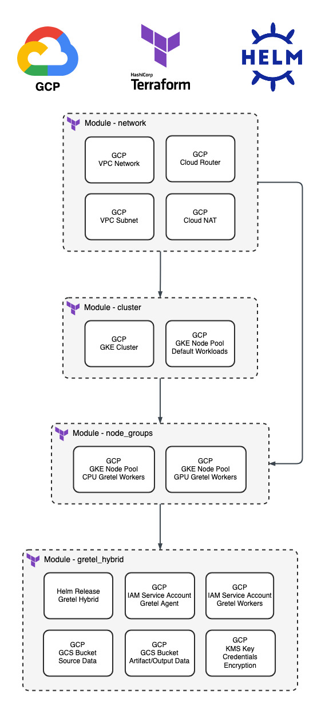

# GCP Gretel Hybrid Setup

## Overview

This module will create a GKE Cluster (and its dependent resources), configure it, and deploy Gretel's Hybrid helm chart (gretel-hybrid) so that hybrid jobs may be run within the cluster. The module supports autoscaling from zero nodes, so the minimum capacity for node groups can be set to zero and cluster autoscaler will provision nodes when it sees pending jobs. This can save on compute costs for expensive GPU nodes as they will only be provisioned when needed, and they will be deleted when idle.

Note: The terms "Gretel Hybrid", "Gretel Agent", and "gretel-agent" are essentially synonymous and may be used interchangeably.

There are 4 primary submodules within this module that may be utilized or left out from a deployment as needed.

- `network` deploys a GCP VPC along with a Subnet for nodes, pods, and services. You do not need this module if you wish to use an existing GCP VPC for your GKE cluster or you already have a GKE cluster.
- `cluster` deploys a GKE cluster and a default node group for any generic services to run (eg. kube-system resources). You do not need this module if you wish to use an existing GKE cluster.
- `node_groups` deploys 2 GKE Node Pools into your GKE cluster. One node pool for CPU Gretel Workers and the other for GPU Gretel Workers. This module is required unless you have provisioned node groups for Gretel Hybrid to use outside of Terraform.
- `gretel_hybrid` deploys the Gretel Agent Helm Chart into your GKE cluster. It also creates the necessary object storage for the Gretel Hybrid service to function. Finally, a KMS key is provisioned for encrypting any connection credentials for source or destination connectors.



Note: This README assumes the operator will be deploying this module from a local workstation using the Terraform CLI. If this module is going to be deployed via GitOps/CICD then it is assumed the operator can adapt these instructions for their automation based use case.

## Table of Contents

- [GCP Gretel Hybrid Setup](#gcp-gretel-hybrid-setup)
  - [Overview](#overview)
  - [Table of Contents](#table-of-contents)
  - [Prerequisites](#prerequisites)
  - [Deployment](#deployment)
    - [Authenticate with GCP](#authenticate-with-gcp)
    - [Setup Gretel API Key](#setup-gretel-api-key)
    - [Setup Terraform State Store](#setup-terraform-state-store)
    - [Configure Variables](#configure-variables)
    - [Deploy](#deploy)
  - [Test Your Hybrid Deployment](#test-your-hybrid-deployment)
    - [Setup Kubeconfig](#setup-kubeconfig)
    - [Examining Kubernetes Resources](#examining-kubernetes-resources)
    - [Run a Job](#run-a-job)
  - [Clean Up](#clean-up)

## Prerequisites

[Install the gcloud cli.](https://cloud.google.com/sdk/docs/install)

[Install the Terraform CLI.](https://developer.hashicorp.com/terraform/tutorials/gcp-get-started/install-cli)

It is also recommended to [install the kubectl CLI](https://kubernetes.io/docs/tasks/tools/) if you want to take a closer look at the Kubernetes resources that are provisioned.

## Deployment

### Authenticate with GCP

The first step necessary is to authenticate with GCP within your shell session. See: https://cloud.google.com/docs/authentication/gcloud

```sh
gcloud auth login
```

### Setup Gretel API Key

Since we do not want to statically define sensitive credentials in clear text, we will pass your Gretel API Key to Terraform [using an environment variable](https://developer.hashicorp.com/terraform/cli/config/environment-variables#tf_var_name) in the format `TF_VAR_<terraform_variable_name>`.

You can get your Gretel API key from the console by clicking the drop down menu in the top right hand corner of the console and selecting "API Key" under the "Account Settings" section. Here is a direct link to this page: https://console.gretel.ai/users/me/key/

After retrieving your API Key export the necessary variable using the below command. 

```sh
export TF_VAR_gretel_api_key="<insert_key_here>"
```

Don't forget to delete this entry from your shell history afterward! The method for doing so can vary by shell.


### Setup Terraform State Store

See: https://developer.hashicorp.com/terraform/language/settings/backends/configuration

Run the `bootstrap_state_backend.sh` script in the `tf/scripts` directory to create a GCS Bucket that can be used as the Terraform backend.

```sh
# Example
cd scripts
./bootstrap_state_backend.sh -b example-state-backend -l us-central1 
```

The script will output an example backend configuration that you can use to declare your terraform backend. 

```sh
$ ./bootstrap_state_backend.sh -b example-state-backend -l us-central1 
Creating gs://example-state-backend/...

Bucket 'example-state-backend' created successfully in location 'us-central1'.

Example Terraform Backend Configuration for GCS:
----------------------------------------------
terraform {
  backend "gcs" {
    bucket  = "example-state-backend"
    prefix  = "terraform/state"
  }
}
```

**Whether you are using the full_deployment or existing_cluster example, take this backend configuration and replace the existing backend configuration in `backend.tf.example`. Then rename the file `backend.tf`.**

For testing purposes you can also use a local backend which can be explicitly declared as shown below. A local backend is the default with Terraform, so you can also leave an empty `terraform {}` block to use a local backend as well.

```
# Local backend option 1
terraform {}

# Local backend option 2
terraform {
  backend "local" {
    path = "terraform.tfstate"
  }
}
```

### Configure Variables

After setting up the backend configuration in `main.tf` you should make a copy of the `terraform.tfvars.template` file and rename it `terraform.tfvars` with the below command.

```sh
cp terraform.tfvars.template terraform.tfvars
```

Then review the variables in the `terraform.tfvars` file and configure them as desired. **You will need to change the bucket name variables so that the created buckets are globally unique.**

### Deploy

Run these `terraform` commands from the root of the current directory.

```sh
# Initialize terraform. This is an idempotent operation and is always safe to do (resources will not be created/destroyed).
terraform init

# View the changes terraform will make upon deployment. Use this any time you make changes to take a closer look at what is going on.
terraform plan

# Deploy the module. This will require user confirmation so don't walk away from your shell until you confirm by typing "yes" and start the deployment.
terraform apply
```

After the resources successfully deploy, you can [schedule a hybrid job](https://docs.gretel.ai/guides/environment-setup/running-gretel-hybrid/gcp-setup#test-your-deployment.2-1) within your Gretel Project and it should run within your cluster! We will cover this later in this README as well.

## Test Your Hybrid Deployment

### Setup Kubeconfig

You can authenticate with your cluster with the following command. The authentication info will be saved to your kubeconfig which lives in `~/.kube/config`

```sh
# This command needs run once to create your kubeconfig for this cluster
gcloud container clusters get-credentials <cluster_name_here> --region=<region_name_here>
```

### Examining Kubernetes Resources

Now we can take a look at the Kubernetes resources using `kubectl`. Let's look at namespaces first. You'll see below that the `gretel-hybrid` namespace exists (created by this module) and so all of our other `kubectl` commands will reference this namespace.

```sh
# List the k8s namespaces. Almost every resource within k8s is associated with a namespace.
kubectl get namespaces

# Example output from a cluster deployed with this module
NAME              STATUS   AGE
default           Active   17h
gmp-public        Active   17h
gmp-system        Active   17h
gretel-hybrid     Active   17h
kube-node-lease   Active   17h
kube-public       Active   17h
kube-system       Active   17h
```

Now we can confirm that the agent and controller pods are running.

```sh
kubectl get pods -n gretel-hybrid

# Example output from a cluster deployed with this module
NAME                            READY   STATUS    RESTARTS   AGE
agent-bbdb79fd8-bnf9r              1/1     Running   0          17h
argo-controller-7ccfc48ccd-h477h   1/1     Running   0          17h
argo-server-75f9945b64-chdvf       1/1     Running   0          17h
controller-678d54cf95-7zllw        1/1     Running   0          17h
```

We can take a look at the gretel-agent logs if we'd like to.

```sh
# Note: If you want to tail the logs add in the -f flag
kubectl logs -l workload=agent -n gretel-hybrid

# Example output from a cluster deployed with this module
2023-11-17T16:56:14.706Z [1] - INFO - gretel_client.agents.agent - Heartbeat from poller, still here...
2023-11-17T16:57:06.058Z [1] - INFO - gretel_client.agents.agent - Heartbeat from poller, still here...
2023-11-17T16:57:57.518Z [1] - INFO - gretel_client.agents.agent - Heartbeat from poller, still here...
```

### Run a Job

Now let's schedule a hybrid job [following our documentation here](https://docs.gretel.ai/guides/environment-setup/running-gretel-hybrid/gcp-setup#test-your-deployment.2-1). The necessary commands are included below.

```sh
# Set the below variables to point to your source GCS Bucket that you defined in the terraform.tfvars file
SOURCE_BUCKET="gretel-hybrid-source"

# Run this block of commands to upload the test CSV data to your source GCS Bucket.
wget https://raw.githubusercontent.com/gretelai/gretel-blueprints/main/sample_data/sample-synthetic-healthcare.csv
gcloud storage cp ./sample-synthetic-healthcare.csv gs://$SOURCE_BUCKET
rm -f sample-synthetic-healthcare.csv

# Create a Gretel Project
GRETEL_PROJECT="Gretel-Hybrid-Test-$RANDOM"
gretel projects create --name "$GRETEL_PROJECT" --display-name "Gretel Hybrid Test"

# Option 1: CPU Test
# Create a model training job with CPU based Amplify model.
gretel models create --config synthetics/amplify \
  --in-data gs://$SOURCE_BUCKET/sample-synthetic-healthcare.csv \
  --runner hybrid \
  --project $GRETEL_PROJECT

# Option 2: GPU Test
# Create a model training job with GPU based ACTGAN model.
gretel models create --config synthetics/tabular-actgan \
    --in-data gs://$SOURCE_BUCKET/sample-synthetic-healthcare.csv \
    --runner hybrid \
    --project $GRETEL_PROJECT
```

Now that a hybrid job is created via the Gretel API, let's look at the corresponding k8s resources. Wait 30 seconds or so after starting your job and then run the below command again to take a look at the pods in our gretel-hybrid namespace.

```sh
kubectl get pods -n gretel-hybrid

# Example output from a cluster deployed with this module
NAME                               READY   STATUS    RESTARTS   AGE
6557bddec4c09f185d8e26e5-xz47x     1/1     Pending   0          3s
agent-669457945b-2vq2n             1/1     Running   0          34m
argo-controller-7ccfc48ccd-jr7rw   1/1     Running   0          34m
argo-server-75f9945b64-zkgv6       1/1     Running   0          34m
controller-678d54cf95-mhtm5        1/1     Running   0          34m
```

We can see a new pod has been created! The `Pending` status in this case means the pod is scheduled and waiting to be assigned to a node. We can describe the pod and see why it isn't running yet.

```sh
kubectl describe pod 6557bddec4c09f185d8e26e5-xz47x -n gretel-hybrid

Events:
  Type     Reason            Age   From                Message
  ----     ------            ----  ----                -------
  Warning  FailedScheduling  103s  default-scheduler   0/4 nodes are available: 1 node(s) had untolerated taint {gretel-worker: cpu}, 3 node(s) didn't match Pod's node affinity/selector. preemption: 0/4 nodes are available: 4 Preemption is not helpful for scheduling..
  Normal   TriggeredScaleUp  66s   cluster-autoscaler  pod triggered scale-up: [{https://www.googleapis.com/compute/v1/projects/production-hybrid-project/zones/us-central1-a/instanceGroups/gke-hybrid-demo-clus-hybrid-demo-gpu--8d66a187-grp 0->1 (max: 5)}]
```

We can see above the "TriggeredScaleUp" event. There wasn't an appropriate node created in the GPU Worker Node Group, so the cluster-autoscaler created one. We have to wait 2-3 minutes for this node to be created and join the cluster. If you deploy your node groups with a minimum auto scaling size of at least 1 node you will not need to wait. The trade off is that running a cloud instance 24/7 will incur costs with GCP.

Wait 2-3 minutes and then run the get pods command again to check on the status of the pod.

```sh
kubectl get pods -n gretel-hybrid

NAME                               READY   STATUS              RESTARTS   AGE
6557bddec4c09f185d8e26e5-xz47x     0/1     ContainerCreating   0          2m38s
agent-669457945b-2vq2n             1/1     Running             0          38m
argo-controller-7ccfc48ccd-jr7rw   1/1     Running             0          38m
argo-server-75f9945b64-zkgv6       1/1     Running             0          38m
controller-678d54cf95-mhtm5        1/1     Running             0          38m
```

The `ContainerCreating` status corresponds with the worker node pulling the relevant docker image which will take a couple minutes for the first image pull. We can take a closer look at the agent logs in the meantime.

```sh
kubectl logs -l workload=agent -n gretel-hybrid

# Example output from a cluster deployed with this module
2023-11-17T19:24:54.321Z [1] - INFO - gretel_client.agents.agent - Heartbeat from poller, still here...
2023-11-17T19:24:54.802Z [1] - INFO - gretel_client.agents.agent - Got train job 6557bddec4c09f185d8e26e5, scheduling now.
2023-11-17T19:24:54.802Z [1] - INFO - gretel_client.agents.drivers.k8s - Creating job:6557bddec4c09f185d8e26e5 in Kubernetes cluster.
2023-11-17T19:24:54.859Z [1] - INFO - gretel_client.agents.agent - Container for job 6557bddec4c09f185d8e26e5 scheduled
2023-11-17T19:24:54.860Z [1] - INFO - gretel_client.agents.agent - Updating status to Pending for job 6557bddec4c09f185d8e26e5
2023-11-17T19:25:45.226Z [1] - INFO - gretel_client.agents.agent - Heartbeat from poller, still here...
2023-11-17T19:26:35.258Z [1] - INFO - gretel_client.agents.agent - Heartbeat from poller, still here...
```

We can see the agent is polling the Gretel API and it saw the new job and created the pod that corresponds with the it.

We can see if we run a `kubectl get pods` again that our job pod is now running. Let's take a look at the logs.

```sh
# We can see the pod is in the Running status now instead of ContainerCreating
kubectl get pods -n gretel-hybrid 

NAME                               READY   STATUS    RESTARTS   AGE
6557bddec4c09f185d8e26e5-xz47x     1/1     Running   0          5m19s
agent-669457945b-2vq2n             1/1     Running   0          41m
argo-controller-7ccfc48ccd-jr7rw   1/1     Running   0          41m
argo-server-75f9945b64-zkgv6       1/1     Running   0          41m
controller-678d54cf95-mhtm5        1/1     Running   0          41m

# Let's tail the logs so we can watch as the job progresses
kubectl logs -f 6557bddec4c09f185d8e26e5-xz47x -n gretel-hybrid
```

The logs are too verbose to include here, but you should be able to watch as the job progresses. To exit out of the log tail hit "CTRL + C". The command will conclude when the job ends, and the pod will be deleted.

```sh
# The job pod is gone once the job ends!
kubectl get pods -n gretel-hybrid 

NAME                               READY   STATUS              RESTARTS   AGE
agent-669457945b-2vq2n             1/1     Running             0          52m
argo-controller-7ccfc48ccd-jr7rw   1/1     Running             0          52m
argo-server-75f9945b64-zkgv6       1/1     Running             0          52m
controller-678d54cf95-mhtm5        1/1     Running             0          52m

```

## Clean Up

To clean up all we can run the below `terraform` command. Always pay attention and make sure you're deleting the resources you expect within the correct GCP project.

```sh
terraform destroy
```